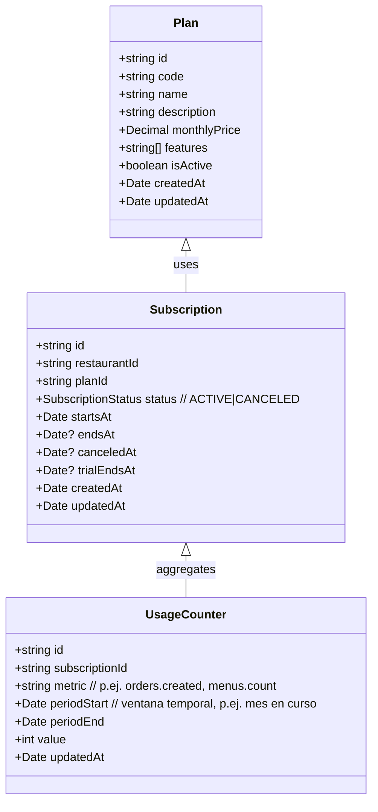
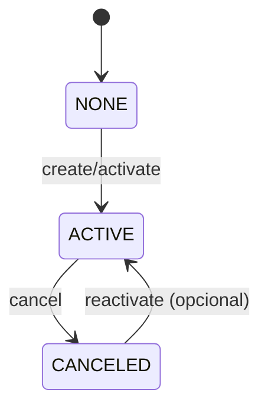
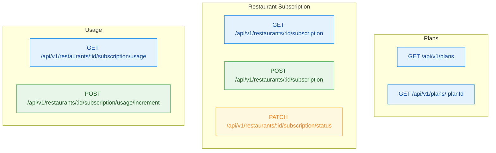
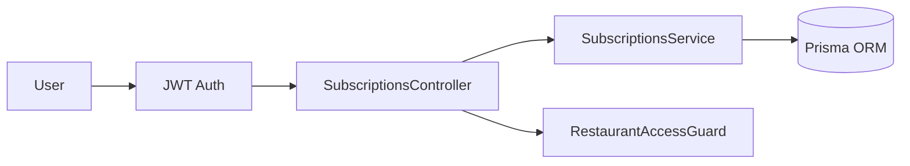

# ResMatic — Plan del Módulo de Suscripciones (MVP)

Este documento describe el diseño inicial (sin pagos) del módulo de Suscripciones, incluyendo modelos, rutas, estados, RBAC, validaciones, DTOs/Swagger y pruebas E2E sugeridas. Incluye diagramas Mermaid para visualizar la arquitectura.

## Objetivo
- Habilitar suscripción por restaurante a un plan del sistema.
- Llevar contadores de uso (UsageCounter) por suscripción para límites/planes.
- Exponer endpoints básicos para listar planes, activar/cancelar suscripción y consultar uso.

---

## Modelos y relaciones (ERD)

Notas:
- Un restaurante debe tener como máximo una suscripción ACTIVA a la vez.
- `monthlyPrice` se serializará como string en respuestas (consistencia con Orders).

---

## Estados de suscripción

---

## Rutas (API v1) y RBAC

Reglas de acceso sugeridas:
- Plans: GET accesible a usuarios autenticados (OWNER/MANAGER/WAITER). CRUD de planes reservado a ADMIN (futuro, fuera de MVP).
- Restaurant Subscription: OWNER/MANAGER. WAITER sin acceso.
- Usage: OWNER/MANAGER. `increment` típicamente interno (service-to-service), pero se expone para MVP con guard y rol.
- Scoping por `restaurantId` con `RestaurantAccessGuard`.

Códigos Swagger:
- 200/201 en éxitos; 400 validaciones; 401 no autenticado; 403 sin permisos/otro restaurante; 404 entidades inexistentes.

---

## Validaciones y reglas
- Solo una suscripción ACTIVA por restaurante.
- `planId` debe existir y estar `isActive = true`.
- Transiciones válidas: `NONE -> ACTIVE`, `ACTIVE -> CANCELED`, `CANCELED -> ACTIVE` (si se permite reactivación en MVP).
- `UsageCounter.metric` normalizado (kebab o dot notation) y periodos alineados a mes calendario por defecto.

---

## DTOs (borrador) y serialización
- PlanDto
  - id, code, name, description, features
  - monthlyPrice: string (ej. "29.00")
  - isActive, createdAt, updatedAt
- SubscriptionDto
  - id, restaurantId, planId, status, startsAt, endsAt?, canceledAt?, trialEndsAt?, createdAt, updatedAt
- CreateSubscriptionDto
  - planId: string
  - startsAt?: Date (default: now)
- ChangeSubscriptionStatusDto
  - status: 'ACTIVE' | 'CANCELED'
  - message?: string
- UsageCounterDto
  - metric: string
  - periodStart: Date
  - periodEnd: Date
  - value: number

Swagger: campos monetarios como string en respuestas; ejemplos consistentes ("9.99").

---

## E2E (escenarios mínimos)
1. Crear suscripción ACTIVA para restaurante con plan válido.
2. Impedir segunda suscripción ACTIVA (409 o 400) en mismo restaurante.
3. Cancelar suscripción -> estado `CANCELED` y `canceledAt` seteado.
4. Reactivar (opcional) -> vuelve a `ACTIVE`.
5. RBAC: OWNER/MANAGER OK; WAITER 403.
6. Scoping: usuario de restaurante A no ve/gestiona B.
7. Listar planes y obtener detalle.
8. Usage: GET devuelve contadores; POST increment afecta únicamente la suscripción del restaurante.

---

## Migraciones y seed
- Crear modelos `Plan`, `Subscription`, `UsageCounter` en Prisma.
- Índices:
  - `Subscription(restaurantId, status)` parcial por ACTIVE (o constraint lógica en servicio).
  - `UsageCounter(subscriptionId, metric, periodStart, periodEnd)` único.
- Seed: planes por defecto (p.ej., "BASIC", "PRO").

---

## Arquitectura (alto nivel)

---

## Futuras extensiones (fuera de MVP)
- Integración con pagos (Stripe/Paddle), webhooks y estado `PAST_DUE`.
- Facturación, historial de facturas, impuestos.
- Límites de uso automáticos (throttling) y resets mensuales.
- Portal de autogestión de suscripción en el frontend.
